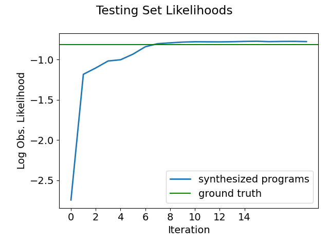
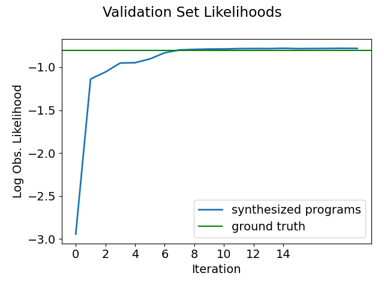
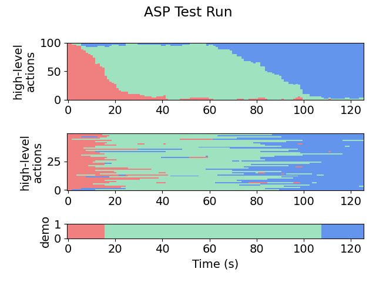
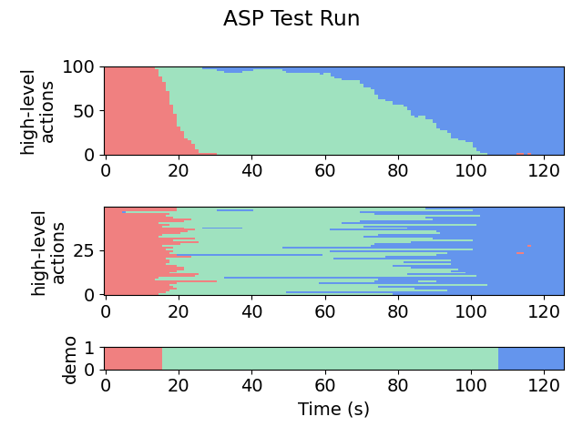
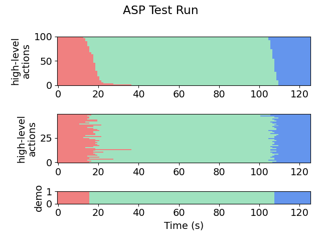
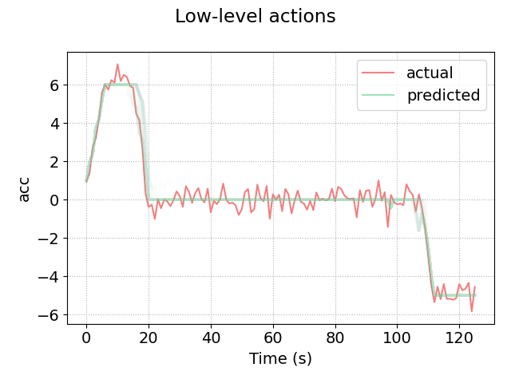

# 1D Target (Stop Sign)
This module is the setup for a simple vehicle driving in a straight line. The goal is to stop before some target stop sign.

## File Organization
- **domain.h** - defines the problem domain, including the spaces $H$, $L$, and $S$
- **robot.h** - defines world models, including the simulation ASP, motor model, and physics model
- **settings.h** - consolidated list of hyperparameters and settings
- **emdips_operations.json** - list of desired operations to be used during program synthesis. See *pips/* for further clarification.
- **robotSets.h** - the set of robots to use when simulating trajectories

Try running the algorithm on the setup (or see **snapshots/** for pre-acquired results).

The most useful/informative outputs will be:
- **out/aspx/**, which stores the synthesized policies. For example, in **out/asp_iter19/asp.txt**, we can see the final policy:
    ```
    ACC -> CON
    fX1=[Flip(Logistic(Minus(vel, vMax), -0.537073, 1.318983), true)]
    ACC -> DEC
    fX1=[Flip(Logistic(Minus(DistTraveled(vel, decMax), dns), 4.230812, 3.988767), true)]
    CON -> DEC
    fX1=[Flip(Logistic(Minus(dns, DistTraveled(vel, decMax)), 3.686273, -2.200493), true)]
    ```
- **plots/testing-accuracy.png** and **plots/testing-likelihoods.png**, which shows the progress of the EM loop across iterations. For example:

    
- **plots/validation-accuracy.png** and **plots/validation-likelihoods.png**, which shows indicates performance on a dataset that was never seen in training. For example:

    
- **plots/testing/xx-x-graph.png**, which gives a visual representation of the high-level labels selected by the policy on the testing set. The first number in the file name indicates the iteration. For example:

    Iteration 1:

    

    Iteration 2:

    
    
    Iteration 10:

    
- **plots/testing/LA-xx-x-graph.png**, which gives a visual representation of the low-level actions predicted by the policy on the testing set. For example, here is iteration 10:

    

Other outputs include:
- **sim/** - contains the simulated trajectories for each robot
- **out/aspx/** - contains the synthesized program at each iteration
- **out/examples/** - contains the particle filter outputs at each iteration, in csv format
- **out/states/** - contains pure ASP outputs, in csv format (i.e. the high-level actions acquired by running the given ASP at each time step)
- **plots/** - contains plots of trajectories for pretty viewing