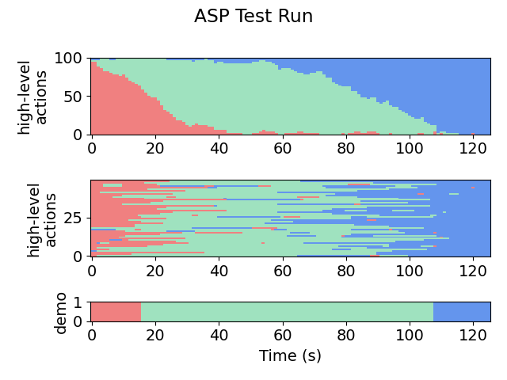
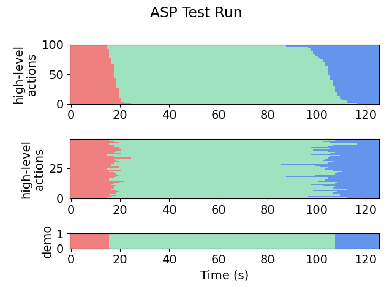
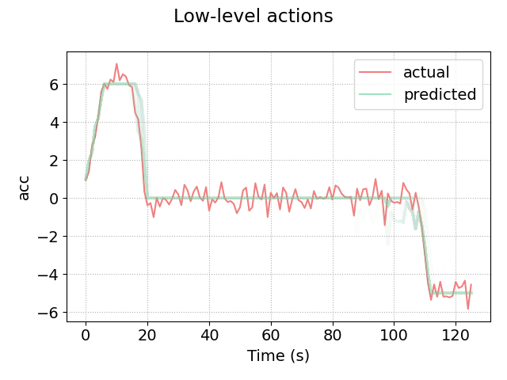

# 1D Target (Stop Sign)
This module is the setup for a simple vehicle driving in a straight line. The goal is to stop before some target stop sign.

Try running the algorithm on the setup by running **make** and **make emng** (or see **snapshots/** for a selection of pre-acquired results).

The most useful/informative outputs will be:
- **out/aspx/**, which stores the synthesized policies. For example, in **out/asp_iter19/asp.txt**, we can see the final policy:
    ```
    ACC -> CON
    Flip(Logistic(Minus(vMax, vel), 0.254044, -1.066688))
    ACC -> DEC
    Flip(Logistic(Minus(dns, DistTraveled(vel, decMax)), -4.124995, -4.151130))
    CON -> DEC
    Flip(Logistic(Minus(dns, DistTraveled(vel, decMax)), 3.386174, -3.434230))
    ```
- **plots/accuracy.png** and **plots/likelihoods.png**, which shows the progress of the EM loop across iterations. Here is a (slightly prettified) version for this task:

    

- **plots/testing/xx-x-graph.png**, which gives a visual representation of the action labels selected by the policy on the testing set. The first number in the file name indicates the iteration. For example:

    Iteration 1:

    

    Iteration 2:

    
    
    Iteration 9:

    

- **plots/testing/LA-xx-x-graph.png**, which gives a visual representation of the low-level observations predicted by the policy on the testing set. For example, here is iteration 9:

    

Other outputs include:
- **sim/** - contains the simulated trajectories for each robot
- **out/aspx/** - contains the synthesized program at each iteration
- **out/examples/** - contains the particle filter outputs at each iteration, in csv format
- **out/states/** - contains pure ASP outputs, in csv format (i.e. the action labels acquired by running the given ASP at each time step)
- **plots/** - contains plots of trajectories for pretty viewing