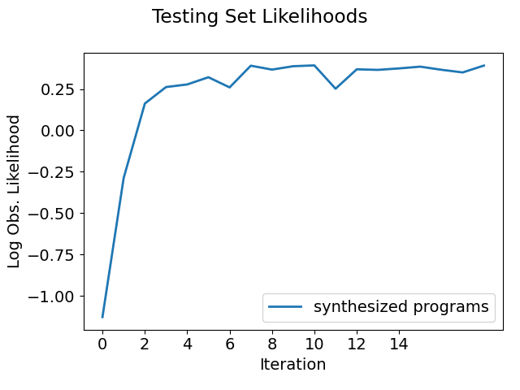
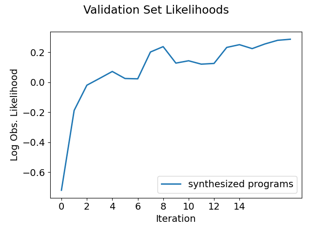

# 2D Highway Env (Highway)
This module is the setup for a vehicle performing lane-changing maneuvers. The goal is to travel as far as possible without crashing. Higher weight is placed on faster speeds.

## File Organization
- **domain.h** - defines the problem domain, including the spaces $H$, $L$, and $S$
- **robot.h** - defines motor model
- **emdips_operations.json** - list of desired operations to be used during program synthesis. See *pips/* for further clarification.
- **settings.h** - consolidated list of hyperparameters and settings

Note that this setup differs from the 1D-target example in that the demonstrations are provided by the python programs in **python-gen** (try running **highway2d.py**). Demonstrations will be placed into that folder automatically. 
As a result, the setup does *not* require filling out *robotSets.h*, a simulation ASP, a physics model, or their corresponding settings.

Try running the algorithm on the setup (or see **snapshots/** for pre-acquired results).

The most useful/informative outputs will be:
- **out/aspx/**, which stores the synthesized policies. For example, in **out/asp_iter19/asp.txt**, we can see the final policy:
    ```
    FASTER -> LANE_LEFT
        And(fX1=[Flip(Logistic(Minus(r_x, l_x), -42.283489, -10.954515), true)], fX1=[Flip(Logistic(Minus(x, f_x), -39.995296, 0.641205), true)])
    FASTER -> LANE_RIGHT
        And(fX1=[Flip(Logistic(Minus(r_x, f_x), 2.816547, 1.569943), true)], fX1=[Flip(Logistic(Minus(x, f_x), -38.728283, 0.874972), true)])
    FASTER -> SLOWER
        fX1=[Flip(Logistic(DividedBy(Minus(f_x, x), vx), 0.971556, -26.162355), true)]
    ...
    ```
- **plots/testing-accuracy.png** and **plots/testing-likelihoods.png**, which shows the progress of the EM loop across iterations. For example:

    
- **plots/validation-accuracy.png** and **plots/validation-likelihoods.png**, which shows indicates performance on a dataset that was never seen in training. For example:

    
- **plots/testing/xx-x-graph.png**, which gives a visual representation of the high-level labels selected by the policy on the testing set. The first number in the file name indicates the iteration. For example:

    Iteration 1:

    

    Iteration 2:

    

    Iteration 15:

    
- **plots/testing/LA-xx-x-graph.png**, which gives a visual representation of the low-level actions predicted by the policy on the testing set. For example, here is iteration 15:

    

We also show the behavior of the synthesized policy directly in the simulator.

Iteration 1:


Iteration 3:


Iteration 8:

