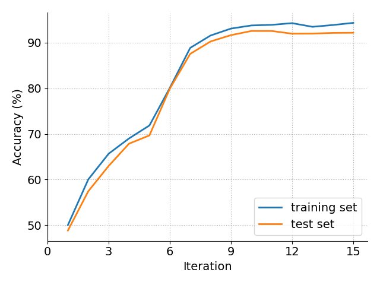
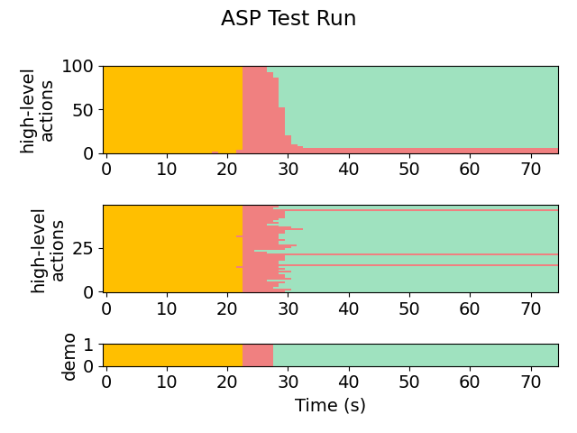
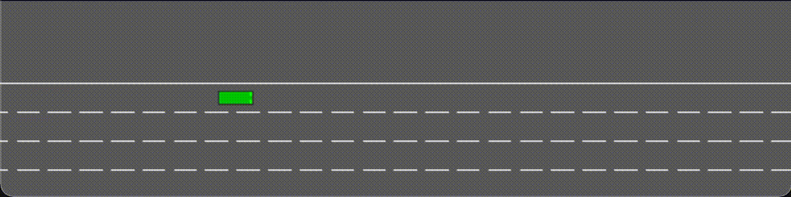
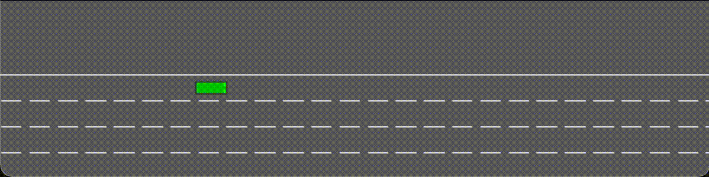

# 2D Merge (Merge)
This module is the setup for a vehicle dealing with lane-merges. The goal is to quickly move from the leftmost lane to the rightmost lane without crashing into other vehicles.

Note that this setup differs from the 1D-target example in that the demonstrations are provided by the python programs in **python-gen** (try running **merge.py**). Demonstrations will be placed into that folder automatically. 
As a result, the setup does *not* require filling out *robotSets.h*, a simulation ASP, a physics model, or their corresponding settings.

Try running the algorithm on the setup (or see **snapshots/** for pre-acquired results).

The most useful/informative outputs will be:
- **out/aspx/**, which stores the synthesized policies. For example, in **out/asp_iter14/asp.txt**, we can see the final policy:
    ```
    FASTER -> LANE_RIGHT
        Flip(Logistic(Minus(r_x, x), 29.547829, 3.164191))
    FASTER -> SLOWER
        Flip(Logistic(DividedBy(Minus(f_x, x), vx), 1.028897, -87.824547))
    LANE_RIGHT -> FASTER
        And(Flip(Logistic(Minus(x, f_x), -118.362206, 14.191378)), Flip(Logistic(Minus(r_x, x), 27.394236, -13.803990)))
    ...
    ```

- **plots/accuracy.png** and **plots/likelihoods.png**, which shows the progress of the EM loop across iterations. Here is a (slightly prettified) version for this task:

    

- **plots/testing/xx-x-graph.png**, which gives a visual representation of the action labels selected by the policy on the testing set. The first number in the file name indicates the iteration. For example:

    Iteration 1:

    

    Iteration 2:

    

    Iteration 9:

    
    
- **plots/testing/LA-xx-x-graph.png**, which gives a visual representation of the low-level observations predicted by the policy on the testing set. For example, here is iteration 9:

    

We also show the behavior of the synthesized policy directly in the simulator.

Iteration 1:



Iteration 3:



Iteration 8:

