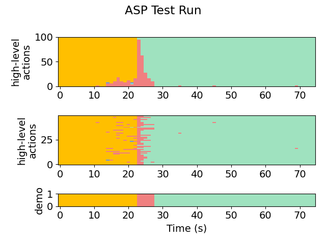
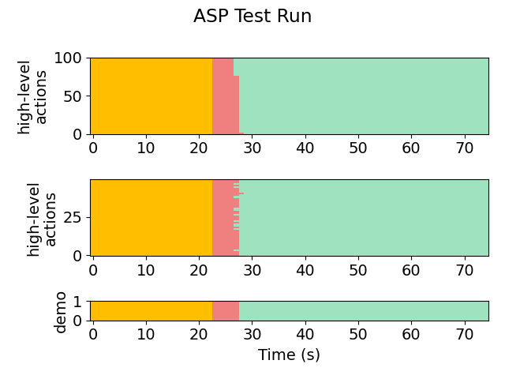
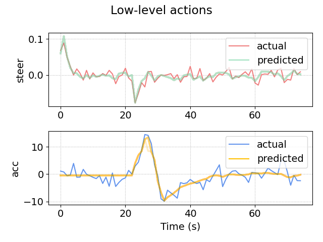
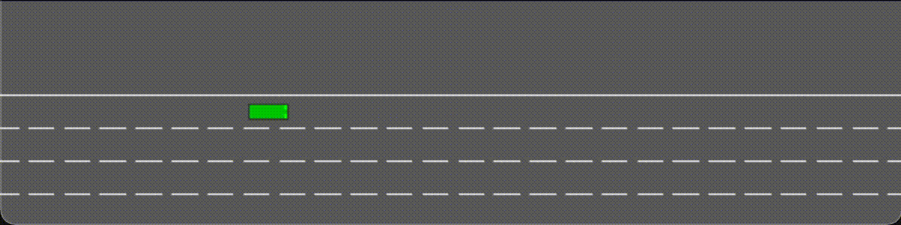

# 2D Merge (Merge)
This module is the setup for a vehicle dealing with lane-merges. The goal is to quickly move from the leftmost lane to the rightmost lane without crashing into other vehicles.

Note that this setup differs from the 1D-target example in that the demonstrations are provided by the python programs in **python-gen** (try running **merge.py**). Demonstrations will be placed into that folder automatically. 
As a result, the setup does *not* require filling out *robotSets.h*, a simulation ASP, a physics model, or their corresponding settings.

Try running the algorithm on the setup (or see **snapshots/** for pre-acquired results).

The most useful/informative outputs will be:
- **out/aspx/**, which stores the synthesized policies. For example, we can see the final policy:
    ```
   if ha == FASTER and false:
       return LANE_LEFT
   if ha == FASTER and flp(lgs(DividedBy(Minus(x, r_x), vx), -1.028642, -35.895672)):
       return LANE_RIGHT
   if ha == FASTER and flp(lgs(Minus(r_x, f_x), -38.665745, 0.395329)):
       return SLOWER
   if ha == LANE_LEFT and false:
       return FASTER
   if ha == LANE_LEFT and false:
       return LANE_RIGHT
   if ha == LANE_LEFT and false:
       return SLOWER
   if ha == LANE_RIGHT and flp(lgs(Minus(r_x, x), 8.462489, -0.367737)):
       return FASTER
   if ha == LANE_RIGHT and false:
       return LANE_LEFT
   if ha == LANE_RIGHT and flp(lgs(DividedBy(Minus(x, r_x), l_vx), -0.377488, 10.546384)):
       return SLOWER
   if ha == SLOWER and flp(lgs(Minus(x, f_x), -39.469845, -0.228033)):
       return FASTER
   if ha == SLOWER and false:
       return LANE_LEFT
   if ha == SLOWER and flp(lgs(Minus(x, r_x), -43.102879, -0.396746)):
       return LANE_RIGHT
   return ha
    ```

- **plots/accuracy.png** and **plots/likelihoods.png**, which shows the progress of the EM loop across iterations. Here is a (slightly prettified) version for this task:

    

- **plots/testing/xx-x-graph.png**, which gives a visual representation of the action labels selected by the policy on the testing set. The first number in the file name indicates the iteration. For example:

    Iteration 1:

    

    Iteration 2:

    

    Iteration 9:

    
    
- **plots/testing/LA-xx-x-graph.png**, which gives a visual representation of the low-level observations predicted by the policy on the testing set. For example, here is iteration 9:

    

We also show the behavior of the synthesized policy directly in the simulator.

Iteration 1:


Iteration 3:


Iteration 8:



We provide the observation model below:
```
step(action):
    target_acc = 0
    target_heading = 0

    if (action == FASTER)
        target_acc = 45 - v
        target_heading = atan((round(y) - y) / 30)
    else if (action == SLOWER)
        target_acc = v_front  - v
        target_heading = atan((round(y) - y) / 30)
    else if (action == LANE_LEFT)
        target_acc = -0.5
        target_heading = -0.15
    else if (action == LANE_RIGHT)
        target_acc = -0.5
        target_heading = 0.15
    
    if (target_heading - heading > steer)
        steer = min(steer + 0.08, target_heading - heading)
    else 
        steer = max(steer - 0.08, target_heading - heading)

    if (target_acc > acc)
        acc = min(target_acc, acc + 4)
    else
        acc = max(target_acc, acc - 6)
``` 