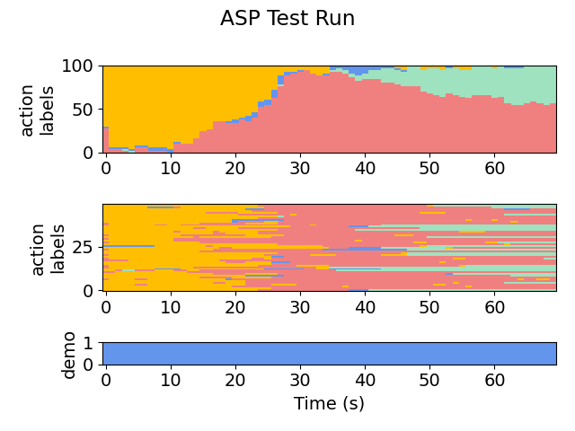
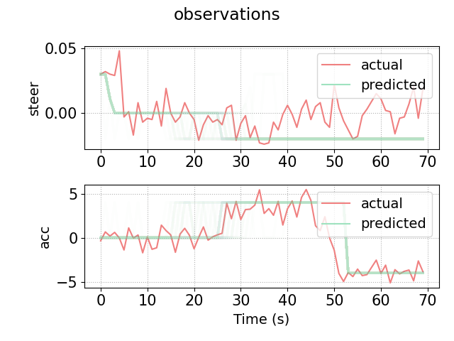

# 2D Merge, Human Demonstrations (Merge - Hand)
This module is roughly the same as MG, but the demonstrations are provided by a human joysticking the controls, so the behavior is significantly less predictable.

Try running the algorithm on the setup (or see **snapshots/** for pre-acquired results).

Results are stored in **out/**. 
- For example, we can see the final policy:
    ```
   if ha == FASTER and flp(lgs(x, 1043.003418, 0.010987)):
       return LANE_LEFT
   if ha == FASTER and Or(flp(lgs(Minus(r_x, x), 24.256481, 0.261414)), flp(lgs(Minus(r_x, x), -7.083443, -10.012507))):
       return LANE_RIGHT
   if ha == FASTER and And(flp(lgs(Minus(r_x, f_x), -5.321127, 27.355986)), flp(lgs(Minus(y, r_y), -2.810756, 45.921741))):
       return SLOWER
   if ha == LANE_LEFT and And(flp(lgs(Plus(y, r_y), 27.675999, -28.561993)), Or(flp(lgs(Minus(r_y, y), 4.606244, -14.761892)), Or(flp(lgs(Minus(f_x, r_x), 131.751694, 4.325001)), flp(lgs(f_x, 364.858917, -1.114238))))):
       return FASTER
   if ha == LANE_LEFT and false:
       return LANE_RIGHT
   if ha == LANE_LEFT and flp(lgs(f_x, 389.029755, -1.134043)):
       return SLOWER
   if ha == LANE_RIGHT and Or(flp(lgs(Minus(r_y, Plus(x, f_y)), -407.739685, -2.902149)), flp(lgs(f_y, 13.234916, 0.499033))):
       return FASTER
   if ha == LANE_RIGHT and flp(lgs(Minus(f_x, r_x), 168.824478, 0.089852)):
       return LANE_LEFT
   if ha == LANE_RIGHT and flp(lgs(Times(x, y), 4744.125977, 0.026073)):
       return SLOWER
   return ha
    ```

Plots are stored in **plots/**. See:
- **plots/testing/xx-x-graph.png**, which gives a visual representation of the action labels selected by the policy on the testing set. For example:

    Iteration 1:

    

    Iteration 2:

    

    Iteration 5:

    
    
- **plots/testing/LA-xx-x-graph.png**, which gives a visual representation of the low-level observations predicted by the policy on the testing set. For example, here is iteration 5:

    
