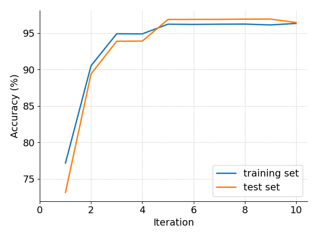
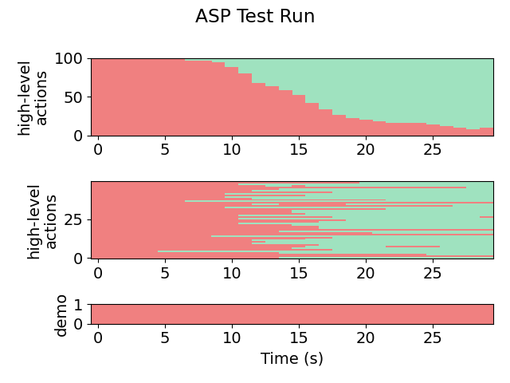
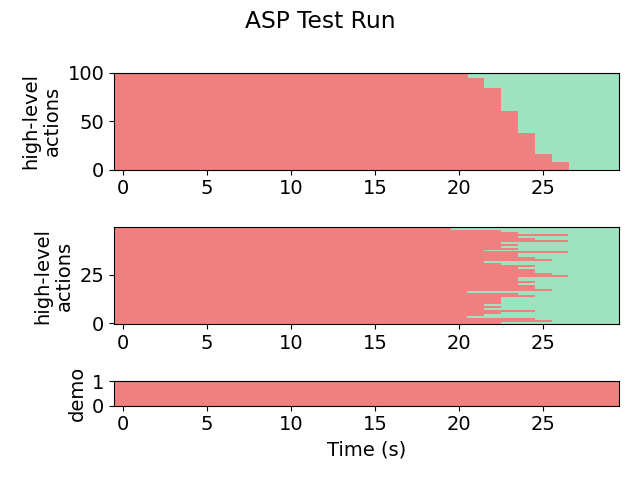

# Pick and Place (PP)

This module is the setup for a robotic arm picking up a cube and placing it at the desired location.

Try running the algorithm on the setup (or see **snapshots/** for pre-acquired results).

The most useful/informative outputs will be:
- **out/aspx/**, which stores the synthesized policies. For example, we can see the final policy:
    ```
    if ha == "MOVE_TO_CUBE" and flp(lgs(Minus(Minus(Abs(x), Abs(bx)), Plus(Minus(z, bz), Minus(Abs(Minus(z, Abs(bx))), Abs(x)))), 0.011845, 539.856995)):
        return "MOVE_TO_TARGET"
    if ha == "MOVE_TO_TARGET" and false:
        return "MOVE_TO_CUBE"
    return ha
    ```

- **plots/accuracy.png** and **plots/likelihoods.png**, which shows the progress of the EM loop across iterations. Here is a (slightly prettified) version for this task:

    

- **plots/testing/xx-x-graph.png**, which gives a visual representation of the action labels selected by the policy on the testing set. The first number in the file name indicates the iteration. For example:

    Iteration 1:

    

    Iteration 2:

    

    Iteration 8:

    

- **plots/testing/LA-xx-x-graph.png**, which gives a visual representation of the low-level observations predicted by the policy on the testing set. For example:

    

We also show the behavior of the synthesized policy directly in the simulator.

