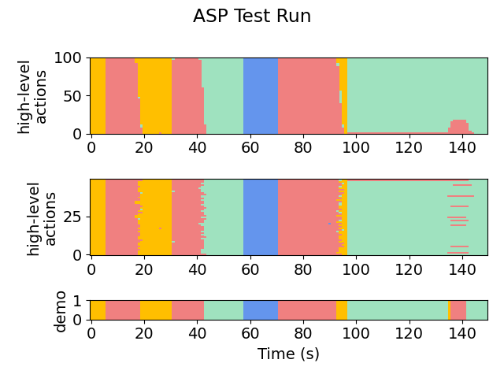
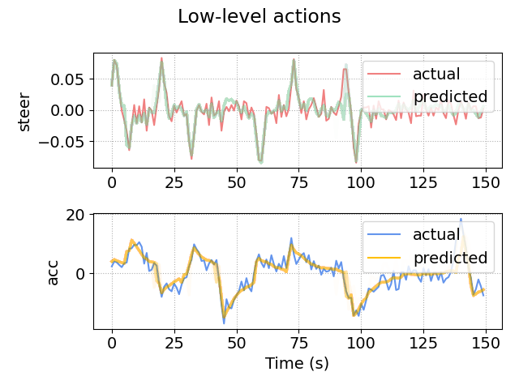
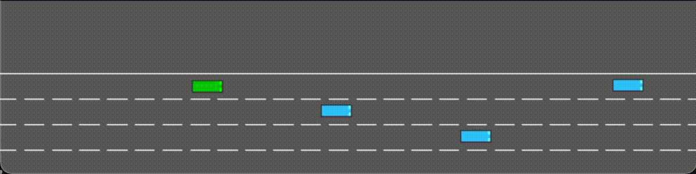

<link rel="stylesheet" href="https://cdnjs.cloudflare.com/ajax/libs/font-awesome/6.0.0-beta3/css/all.min.css">
<link rel="stylesheet" type="text/css" href="../assets/style.css">

# 2D Highway Env (Pass Traffic)
This module is the setup for a vehicle performing lane-changing maneuvers. The goal is to travel as far as possible without crashing.

Note that this setup differs from the 1D-target example in that the demonstrations are provided by the python programs in **python-gen** (try running **highway2d.py**). Demonstrations will be placed into that folder automatically. 
As a result, the setup does *not* require filling out *robotSets.h*, a simulation ASP, a physics model, or their corresponding settings.

Try running the algorithm on the setup (or see **snapshots/** for pre-acquired results).

The most useful/informative outputs will be:
- **out/aspx/**, which stores the synthesized policies. For example, we can see the final policy (which we have cleaned up here for presentation):
    ```
   if ha == FASTER and And(flp(lgs(Minus(r_x, l_x), -42.325607, -11.322358)), flp(lgs(Minus(x, f_x), -39.853004, 0.471738))):
       return LANE_LEFT
   if ha == FASTER and And(flp(lgs(Minus(r_x, f_x), 2.268923, 1.691306)), flp(lgs(Minus(x, f_x), -37.500061, 0.498594))):
       return LANE_RIGHT
   if ha == FASTER and flp(lgs(DividedBy(Minus(f_x, x), vx), 0.977072, -31.665253)):
       return SLOWER
   if ha == LANE_LEFT and flp(lgs(DividedBy(Minus(f_x, x), r_vx), 2.090207, 93.243362)):
       return FASTER
   if ha == LANE_LEFT and false:
       return LANE_RIGHT
   if ha == LANE_LEFT and flp(lgs(Minus(l_x, x), 30.264160, -3.164596)):
       return SLOWER
   if ha == LANE_RIGHT and flp(lgs(DividedBy(Minus(f_x, x), vx), 1.538538, 14.793274)):
       return FASTER
   if ha == LANE_RIGHT and false:
       return LANE_LEFT
   if ha == LANE_RIGHT and flp(lgs(DividedBy(Minus(x, r_x), vx), -0.984751, 182.378754)):
       return SLOWER
   if ha == SLOWER and flp(lgs(DividedBy(Minus(f_x, x), vx), 1.495547, 73.774384)):
       return FASTER
   if ha == SLOWER and flp(lgs(Minus(l_x, f_x), 5.026824, 4.910437)):
       return LANE_LEFT
   if ha == SLOWER and flp(lgs(Minus(r_x, f_x), 1.479489, 1.003578)):
       return LANE_RIGHT
   return ha
    ```

- **plots/accuracy.png** and **plots/likelihoods.png**, which shows the progress of the EM loop across iterations. Here is a (slightly prettified) version for this task:

    

- **plots/testing/xx-x-graph.png**, which gives a visual representation of the action labels selected by the policy on the testing set. The first number in the file name indicates the iteration. For example:

    Iteration 1:

    

    Iteration 2:

    

    Iteration 14:

    
    
- **plots/testing/LA-xx-x-graph.png**, which gives a visual representation of the low-level observations predicted by the policy on the testing set. For example, here is iteration 14:

    

We also show the behavior of the synthesized policy directly in the simulator.

Iteration 1:



Iteration 3:


Iteration 8:

