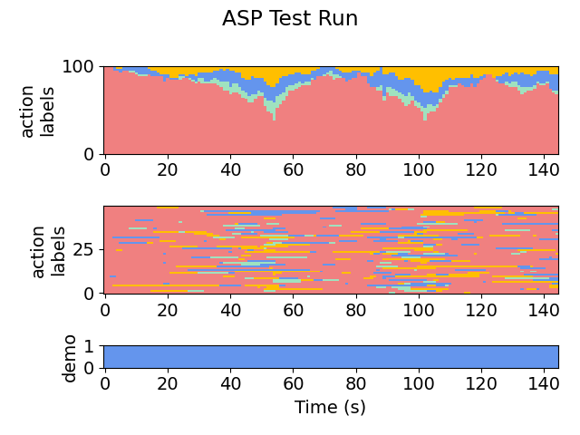
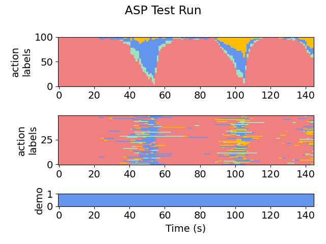
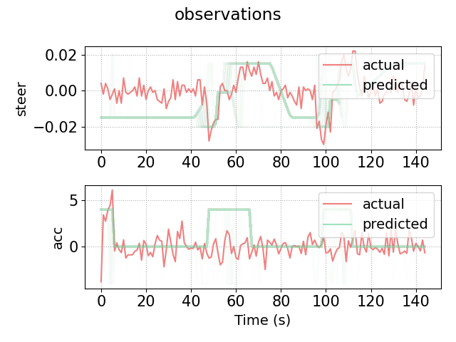

# 2D Highway, Human Demonstrations (Pass Traffic - Hand)
This module is roughly the same as PT, but the demonstrations are provided by a human joysticking the controls, so the behavior is significantly less predictable.

Try running the algorithm on the setup (or see **snapshots/** for pre-acquired results).

Results are stored in **out/**. 
- For example, we can see the final policy:
   ```
    if ha == FASTER and And(flp(lgs(f_vx, 35.021538, -21.117664)), And(flp(lgs(Minus(f_x, l_x), -28.455282, -0.111654)), And(flp(lgs(f_vx, 21.367447, -32.117924)), flp(lgs(Minus(f_x, x), 22.931559, -0.621136))))):
       return LANE_LEFT
    if ha == FASTER and flp(lgs(DividedBy(Minus(f_x, x), f_vx), 0.903634, -9.377876)):
       return LANE_RIGHT
    if ha == FASTER and Or(flp(lgs(Minus(r_x, l_x), 142.693558, 26.650047)), Or(flp(lgs(Plus(f_vx, r_vx), -108.861458, -0.039834)), And(flp(lgs(vx, 24.874939, -61.811741)), flp(lgs(Minus(f_x, Plus(l_x, r_x)), -557.253906, -0.012443))))):
       return SLOWER
    if ha == LANE_LEFT and And(flp(lgs(r_vx, 19.766947, 2.068509)), flp(lgs(Minus(x, f_x), -31.710594, -0.294839))):
       return FASTER
    if ha == LANE_LEFT and Or(flp(lgs(DividedBy(x, l_vx), 34.269012, 245.851440)), And(flp(lgs(x, 235.960114, -0.653907)), Or(flp(lgs(l_vx, 126.732285, -0.239940)), flp(lgs(Plus(l_vx, r_vx), 44.333492, 2.931920))))):
       return LANE_RIGHT
    if ha == LANE_LEFT and flp(lgs(vx, 24.829386, -86.008926)):
       return SLOWER
    if ha == LANE_RIGHT and And(flp(lgs(l_vx, 20.476099, 0.709218)), flp(lgs(Minus(x, f_x), -26.473980, -0.609106))):
       return FASTER
    if ha == LANE_RIGHT and And(flp(lgs(vx, 25.023340, 8.410436)), And(flp(lgs(Plus(l_vx, r_vx), 41.128242, -2.412731)), flp(lgs(f_vx, 20.260880, -5.940400)))):
       return LANE_LEFT
    if ha == LANE_RIGHT and flp(lgs(Times(vx, Plus(Plus(vx, Plus(vx, l_vx)), f_vx)), 2233.293213, -0.184224)):
       return SLOWER
    if ha == SLOWER and flp(lgs(Times(vx, Plus(Plus(vx, vx), f_vx)), 1764.555542, 0.051010)):
       return FASTER
    if ha == SLOWER and And(flp(lgs(DividedBy(Minus(r_x, f_x), l_vx), 1.813058, 0.469895)), flp(lgs(vx, 24.549904, 27.209173))):
       return LANE_LEFT
    if ha == SLOWER and Or(flp(lgs(Plus(r_vx, r_vx), 37.099731, -12.132344)), flp(lgs(vx, 25.158022, 46.733471))):
       return LANE_RIGHT
    return ha
    ```

Plots are stored in **plots/**. See:
- **plots/testing/xx-x-graph.png**, which gives a visual representation of the action labels selected by the policy on the testing set. For example:

    Iteration 1:

    

    Iteration 2:

    

    Iteration 5:

    
    
- **plots/testing/LA-xx-x-graph.png**, which gives a visual representation of the low-level observations predicted by the policy on the testing set. For example, here is iteration 5:

    
