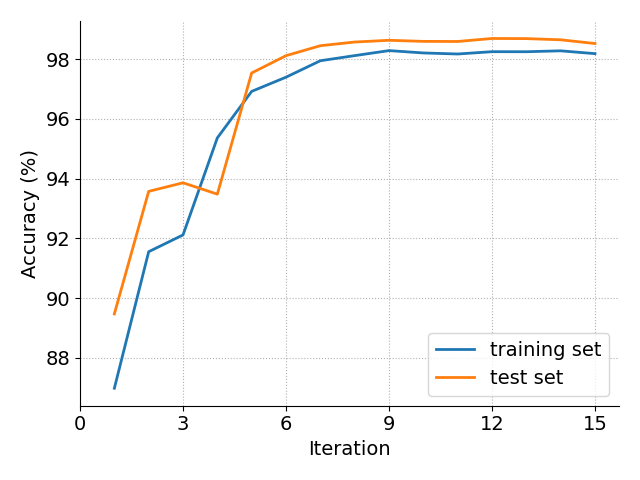
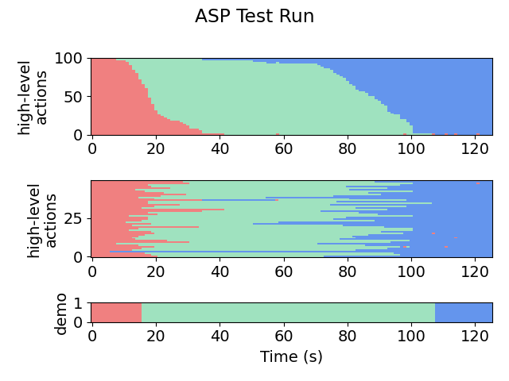

# 1D Target (Stop Sign)
This module is the setup for a simple vehicle driving in a straight line. The goal is to stop before some target stop sign.

Try running the algorithm on the setup by running **make** and **make emng** (or see **snapshots/** for a selection of pre-acquired results).

The most useful/informative outputs will be:
- **out/aspx/**, which stores the synthesized policies. For example, we can see the final policy (which we have cleaned up here for presentation):
    ```
   if ha == ACC and flp(lgs(Minus(v, v_max), -0.456573, 1.388253)):
       return CON
   if ha == ACC and flp(lgs(Minus(dns, DistTraveled(v, a_min)), -6.926392, -2.609171)):
       return DEC
   if ha == CON and flp(lgs(Minus(DistTraveled(v, a_min), dns), -2.829544, 0.814321)):
       return DEC
   return ha
    ```
- **plots/accuracy.png** and **plots/likelihoods.png**, which shows the progress of the EM loop across iterations. Here is a (slightly prettified) version for this task:

    

- **plots/testing/xx-x-graph.png**, which gives a visual representation of the action labels selected by the policy on the testing set. The first number in the file name indicates the iteration. For example:

    Iteration 1:

    

    Iteration 2:

    
    
    Iteration 9:

    

- **plots/testing/LA-xx-x-graph.png**, which gives a visual representation of the low-level observations predicted by the policy on the testing set. For example, here is iteration 9:

    

Other outputs include:
- **sim/** - contains the simulated trajectories for each robot
- **out/aspx/** - contains the synthesized program at each iteration
- **out/examples/** - contains the particle filter outputs at each iteration, in csv format
- **out/states/** - contains pure ASP outputs, in csv format (i.e. the action labels acquired by running the given ASP at each time step)
- **plots/** - contains plots of trajectories for pretty viewing