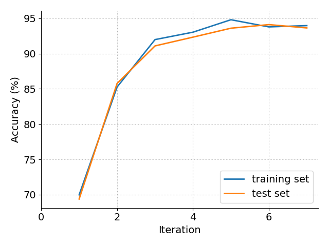
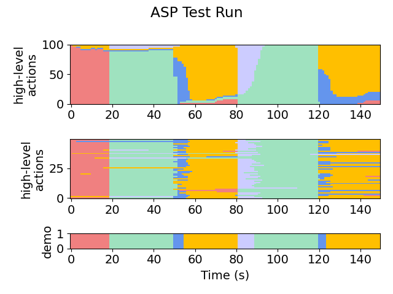
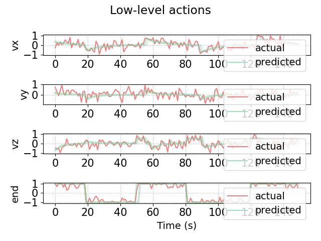

# Stack (ST)

This module is the setup for a robotic arm stacking two cubes at the desired location, in the correct order.

Try running the algorithm on the setup (or see **snapshots/** for pre-acquired results).

The most useful/informative outputs will be:
- **out/aspx/**, which stores the synthesized policies. For example, we can see the final policy:
    ```
   if ha == 'GRASP' and flp(lgs(-0.100266, -80.894936, tz2)):
       return 'MOVE_TO_TARGET'
   elif ha == 'LIFT' and flp(lgs(0.6139, 41.856, bz1 + ty2)):
       return 'MOVE_TO_CUBE_BOTTOM'
   elif ha == 'LIFT' and flp(lgs(-0.142514, -103.338959, bz1)):
       return 'MOVE_TO_CUBE_TOP'
   elif ha == 'MOVE_TO_CUBE_BOTTOM' and flp(lgs(0.4281, 116.65596, ty2)):
       return 'LIFT'
   elif ha == 'MOVE_TO_CUBE_BOTTOM' and flp(lgs(-0.332, -20.043522, z)):
       return 'MOVE_TO_CUBE_TOP'
   elif ha == 'MOVE_TO_CUBE_BOTTOM' and flp(lgs(0.02998, 29400.211, bz1 + tz2)):
       return 'MOVE_TO_TARGET'
   elif ha == 'MOVE_TO_CUBE_TOP' and flp(lgs(-0.009927, 83562.8, bz2 + bz2)):
       return 'GRASP'
   elif ha == 'MOVE_TO_CUBE_TOP' and flp(lgs(0.176457, 44.735584, tz2)):
       return 'MOVE_TO_CUBE_BOTTOM'
   elif ha == 'MOVE_TO_TARGET' and flp(lgs(0.002998, -41319.92, abs(tx2) + abs(ty2))):
       return 'LIFT'
   return ha
    ```

- **plots/accuracy.png** and **plots/likelihoods.png**, which shows the progress of the EM loop across iterations. Here is a (slightly prettified) version for this task:

    

- **plots/testing/xx-x-graph.png**, which gives a visual representation of the action labels selected by the policy on the testing set. The first number in the file name indicates the iteration. For example:

    Iteration 1:

    

    Iteration 2:

    

    Iteration 7:

    
- **plots/testing/LA-xx-x-graph.png**, which gives a visual representation of the low-level observations predicted by the policy on the testing set. For example:

    

We also show the behavior of the synthesized policy directly in the simulator.

