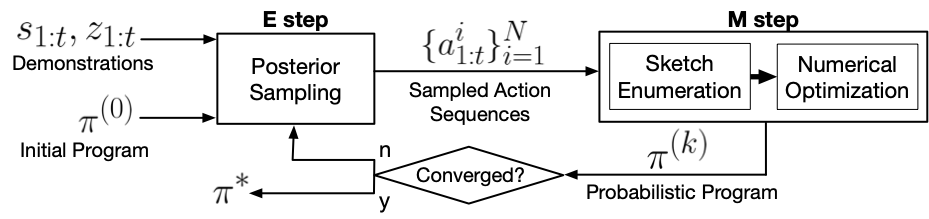
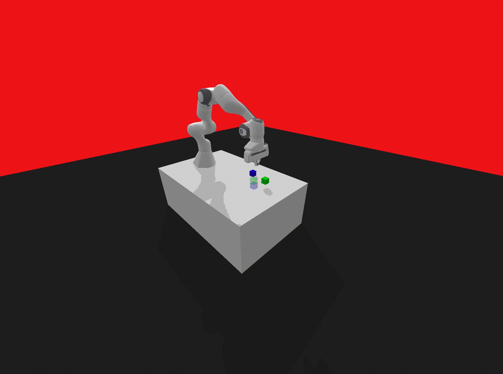
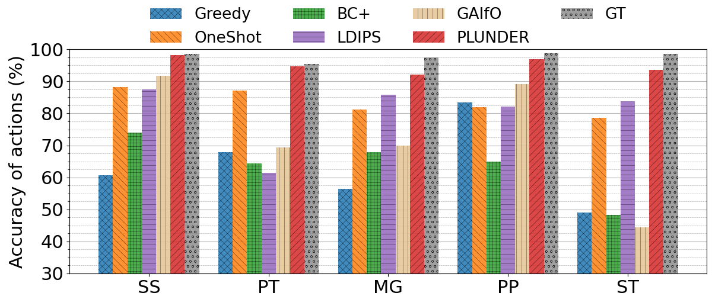
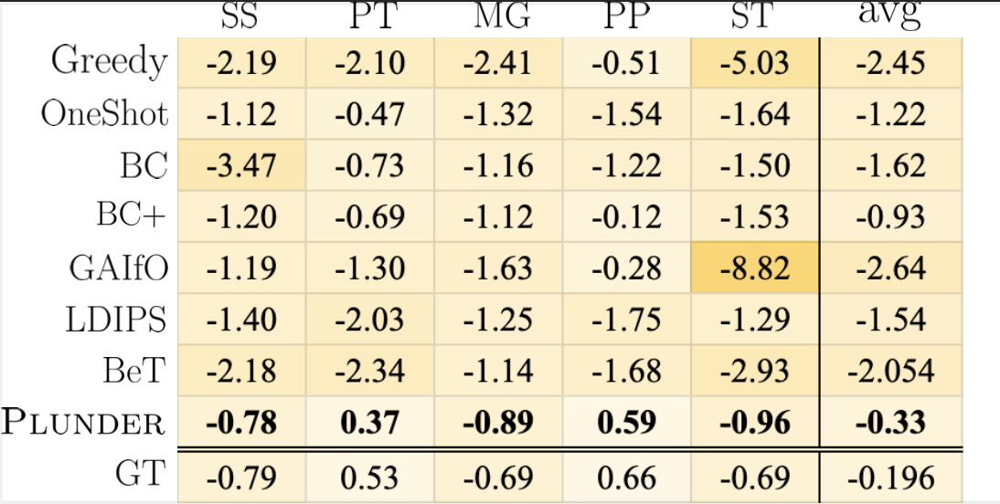
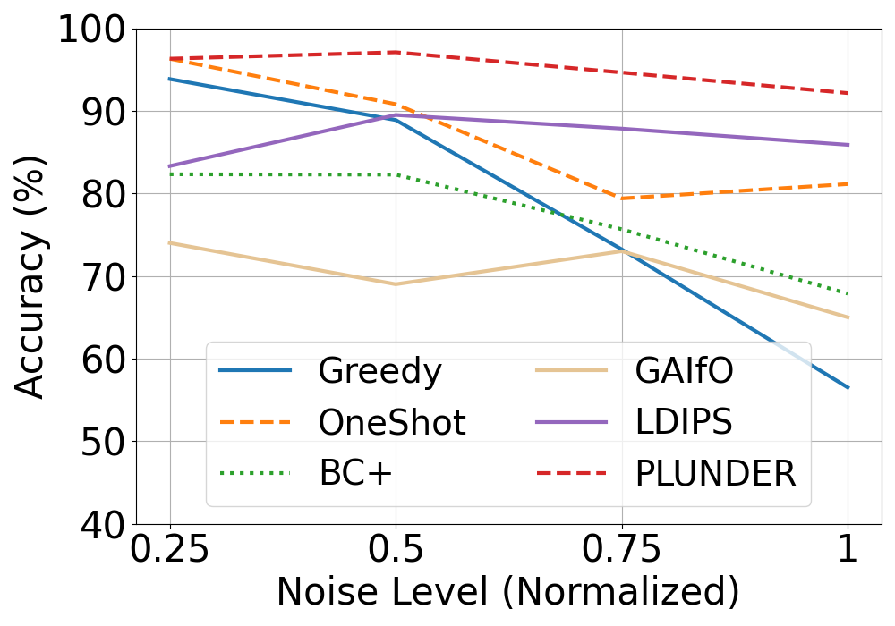
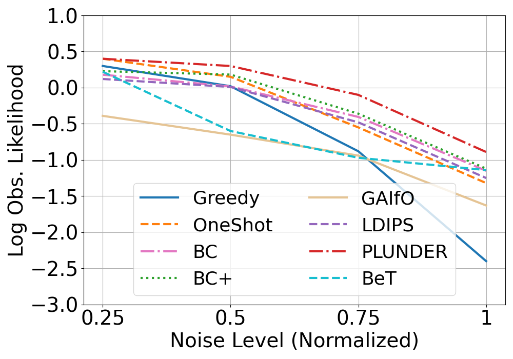
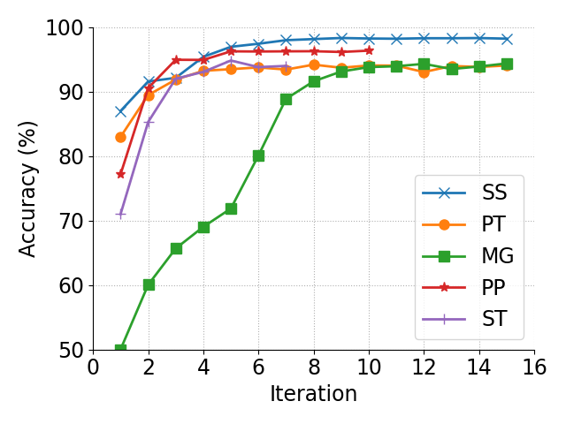
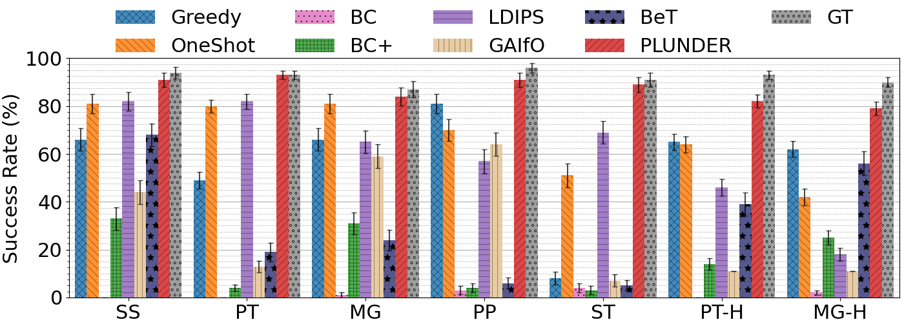

<link rel="stylesheet" href="https://cdnjs.cloudflare.com/ajax/libs/font-awesome/6.0.0-beta3/css/all.min.css">
<link rel="stylesheet" type="text/css" href="assets/style.css">


---
<center>
<p class="title"><span class="smallcaps">Plunder</span>: Probabilistic Program Synthesis for Learning from Unlabeled and Noisy Demonstrations</p>

<p class="authors">Jimmy Xin, Linus Zheng, Kia Rahmani, Jiayi Wei, Jarrett Holtz, Isil Dillig, Joydeep Biswas</p>
</center>


<div class="icon-container">

  <a href="https://arxiv.org/abs/2303.01440" class="icon-button arxiv" target="_blank" title="ArXiv Paper">
    <i class="fas fa-scroll"></i>
    <span>Paper</span>
  </a>

  <a href="https://github.com/ut-amrl/plunder" class="icon-button github" target="_blank" title="GitHub Repository">
    <i class="fab fa-github"></i>
    <span>GitHub</span>
  </a>


  <a href="https://drive.google.com/file/d/1pNcO-I1_4wSSSYrPOzc48nzV2xzx7fkz/view?usp=sharing" class="icon-button drive" target="_blank" title="Supplementary Videos and Tables">
    <i class="fab fa-google-drive"></i>
    <span>Supplements</span>
  </a>

  <a href="https://www.youtube.com/watch?v=Fy1P_46c54A" class="icon-button youtube" target="_blank" title="YouTube Video">
    <i class="fab fa-youtube"></i>
    <span>Short Video</span>
  </a>


</div>

---
## Abstract

Imitation Learning (IL) is a popular approach for teaching robots how to perform novel tasks using only human demonstrations. <span class="smallcaps">Plunder</span> is a novel Programmatic Imitation Learning (PIL) algorithm that integrates a probabilistic program synthesizer in an iterative Expectation-Maximization (EM) framework. Our method is robust against actuation errors in demonstrations, and the synthesized probabilistic policies intuitively reflect uncertainties commonly found in human demonstrations. We benchmark <span class="smallcaps">Plunder</span> against several established IL techniques, and demonstrate its superiority across five challenging imitation learning tasks under noise. <span class="smallcaps">Plunder</span> policies achieve 95% accuracy in matching the given demonstrations, outperforming the next best baseline by 19%. Additionally, policies generated by <span class="smallcaps">Plunder</span> successfully complete the tasks 17% more frequently than the nearest baseline.

<center>
<figure>

<br>
<figurecaption style="font-size: 12px"><i>Overview of the <span class="smallcaps">Plunder</span> algorithm</i></figurecaption>
</figure>
</center>


## Experiments
<div style="display: flex;">
<p><b><a href="./experiments/SS.html">Stop Sign (SS)</a></b>: acceleration control in a straight line.
<br><b><a href="./experiments/PT.html">Pass Traffic (PT)</a></b>: switching lanes in highway traffic. <a href="./experiments/PT_H.html">See here for the version with human demonstrations.</a>
<br><b><a href="./experiments/MG.html">Merge (MG)</a></b>: merging from the leftmost to the rightmost lane in highway traffic. <a href="./experiments/MG_H.html">See here for the version with human demonstrations.</a>
<br><b><a href="./experiments/PP.html">Pick and Place (PP)</a></b>: controlling a robot arm to grab and object and move it to a designated location.
<br><b><a href="./experiments/ST.html">Stack (ST)</a></b>: stacking two boxes on top of each other at a designated location.
</p>

</div>

### Experiment Details

| Task      | Environment | Action Labels | Observed Variables | State Variables | Training Set Size | Testing Set Size |
| - | - | - | - | - | - | - |
| SS      | AV       | ACC, DEC, CON | acc | a_min, a_max, v, v_max, target, dist_to_target | 10 | 20 |
| PT      | AV       | FASTER, SLOWER, LANE_LEFT, LANE_RIGHT | acc, steer | x, v, front_x, front_v, right_x, right_v, left_x, left_v | 10 | 20 |
| MG      | AV       | FASTER, SLOWER, LANE_LEFT, LANE_RIGHT | acc, steer | x, v, front_x, front_v, right_x, right_v, left_x, left_v | 10 | 20 |
| PP      | RA       | MOVE_TO_CUBE, MOVE_TO_TARGET | dx, dy, dz, d_end | x, y, z, block_x, block_y, block_z, target_x, target_y, target_z | 5 | 15 |
| ST      | RA       | MOVE_TO_CUBE1, MOVE_TO_CUBE2, MOVE_TO_TARGET, GRASP, LIFT | dx, dy, dz, d_end | x, y, z, block_x, block_y, block_z, block2_x, block2_y, block2_z, target_x, target_y, target_z | 10 | 10 |

---
## Aggregate Results

### AST sizes
For full policies, please visit each module's page.

| Task | SS | PT | MG | PP | ST | PT_H | MG_H |
| - | - | - | - | - | - | - | - |
| AST size (total) | 25 |	96 | 46 | 22 | 55 | 196 | 98 |
| Average size per transition | 8.33 | 9.6 | 7.67 | 22 | 6.11 | 16.33 | 12.25 |

### Accuracy Results
Visualizes the accuracy of action labels each learned policy produces on the test trajectories.



### Likelihood Heatmap
Visualizes the log-likelihood of observations generated by each policy on the test trajectories.



### Noise Experiments
Visualizes the degradation of performance of each approach, measured both by accuracy and log-likelihood of observations.



### EM Loop Convergence
Visualize convergence for each task. More graphs can be found on each module's page.



### Success Rates
Each approach's policy was tested by running it in the environment 100 times, and the number of successful runs was recorded. The results are visualized below, along with our metrics for what is considered a successful run.



| Task | Success Metric |
| - | - |
| SS | Coming to a stop near the target |
| PT | Maintaining some minimum velocity and being in a valid lane for a specified period of time |
| MG | Reaching the rightmost lane, starting from the leftmost lane |
| PP | Placing a randomly-initialized cube at a randomly-initialized target position |
| ST | Placing two randomly-initialized cubes in a stack at a randomly-initialized target position, in the correct order |

### Particle Filter Implementation
Our particle filter follows from a standard implementation and can be found here: https://github.com/ut-amrl/plunder/blob/main/particleFilter/pf.h

The algorithm is as follows:

```
1. Initialize all particles to start with the default label.
2. for i=1..n
3.      Forward-propagate particles by acquiring new labels for each particle using the probabilistic policy π.
4.      Reweight particles using the observation model.
5.      Normalize weights.
6.      Resample particles to remove ineffective particles.
7. Trace back particle lineages to acquire full trajectories.
```

## Citation
<p class="code-block">
@ARTICLE{10493855,<br>
      &ensp;&ensp;author={Xin, Jimmy and Zheng, Linus and Rahmani, Kia and Wei, Jiayi and Holtz, Jarrett and Dillig, Isil and Biswas, Joydeep},<br>
      &ensp;&ensp;journal={IEEE Robotics and Automation Letters}, <br>
      &ensp;&ensp;title={Programmatic Imitation Learning From Unlabeled and Noisy Demonstrations}, <br>
      &ensp;&ensp;year={2024},<br>
      &ensp;&ensp;volume={},<br>
      &ensp;&ensp;number={},<br>
      &ensp;&ensp;pages={1-8},<br>
      &ensp;&ensp;keywords={Task analysis;Trajectory;Probabilistic logic;Noise measurement;Training data;Noise;Approximation algorithms},<br>
      &ensp;&ensp;doi={10.1109/LRA.2024.3385691}}<br>
</p>
  


